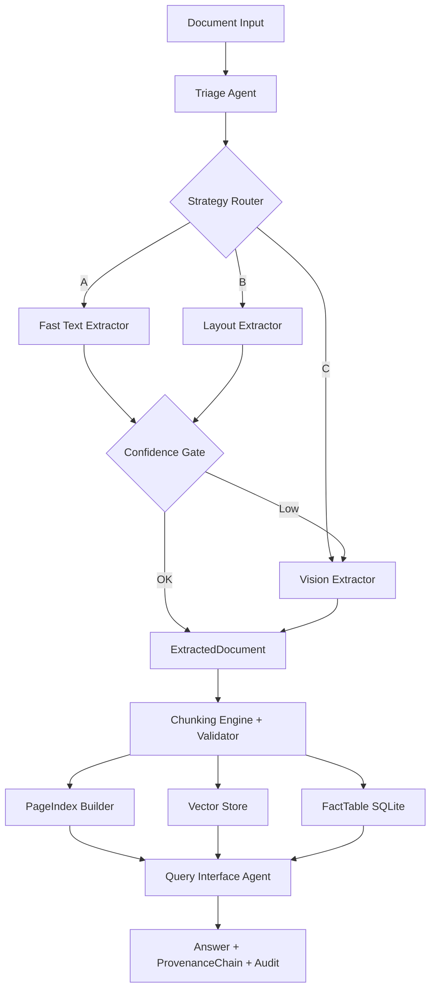

# DOMAIN_NOTES

## Extraction Decision Tree

1. Compute per-page signals from PDF parser:
- Character count
- Character density (`chars / page_area`)
- Image ratio proxy (`image_count / max_images_for_ratio`)

2. Classify origin:
- `scanned_image` when density is low and image ratio is high.
- `native_digital` when density is high and image ratio is low.
- `mixed` otherwise.

3. Estimate layout complexity:
- `table_heavy` if pipe-delimited/table-like lines are frequent.
- `multi_column` if short-line frequency is high.
- `figure_heavy` if figure/chart indicators appear.
- `single_column` otherwise.

4. Strategy routing:
- Strategy A (`fast_text`) for `fast_text_sufficient`
- Strategy B (`layout_aware`) for `needs_layout_model`
- Strategy C (`vision_augmented`) for `needs_vision_model`

5. Escalation guard:
- If strategy confidence < `confidence_minimum`, escalate A->B->C.

## Observed Failure Modes and Mitigation

- Structure collapse: flattening of tables into text streams.
  Mitigation: promote candidate tables to structured JSON in layout strategy.

- Context poverty: semantically incomplete chunks hurt retrieval.
  Mitigation: LDU chunking with rule constraints and parent-section propagation.

- Provenance blindness: answers without source trace are untrustworthy.
  Mitigation: every chunk carries page refs, bbox, and content hash.

## Failure Analysis by Corpus Class

### Class A (Annual Financial Report, native digital)

- Failure observed: multi-column financial narrative occasionally routed through fast-text when confidence was high, reducing table fidelity.
- Fix applied: routing policy updated so `table_heavy` profiles start with Strategy B (`layout_aware`) to prioritize structured table extraction.

### Class B (Scanned Government/Legal, image-based)

- Failure observed: strategy C completed with placeholder OCR when local VLM call failed (provider attempts showed runtime payload/render incompatibilities).
- Fix applied:
  - forced OCR path for scanned/needs-vision profiles,
  - page rendering fallback (`pypdfium2`),
  - multimodal payload variants for OpenAI-compatible local endpoints,
  - provider-attempt diagnostics in extraction ledger.

### Class C (Technical mixed text+tables)

- Failure observed: PageIndex retrieval gains were inconsistent on weak extraction output.
- Fix applied:
  - persisted extracted/chunk artifacts for inspection,
  - improved query/pageindex token-overlap navigation,
  - added retrieval precision metrics output (`pageindex_metrics`).

### Class D (Table-heavy fiscal data)

- Failure observed: heuristic table detection could over/under-detect in dense fiscal layouts.
- Fix applied:
  - layout adapter chain support (`docling/mineru/both`),
  - chunk validator checks that table headers remain bound to table content,
  - table metrics script for precision/recall evaluation.

## Cost-Quality Tradeoff

- Strategy A (fast text): lowest cost, sufficient for clean native PDFs.
- Strategy B (layout aware): medium cost, needed for table/multi-column layouts.
- Strategy C (vision): highest cost, reserved for scanned or low-confidence extraction.

Budget guard prevents high-cost overrun per document.

### Practical VLM Cost Tradeoff (Local vs Cloud)

- Local VLM (LM Studio): treated as operationally low/zero monetary cost in preflight policy; primary risk is reliability (runtime compatibility).
- Cloud VLM fallback: higher reliability potential, but explicit cost risk; guarded by per-document cap and strategy cap.
- Recommended production policy:
  - local-first provider chain,
  - confidence-gated fallback to paid provider,
  - hard cap enforcement + provider attempts logging for auditability.

## Normalization Guarantees by Strategy

- Strategy A (`fast_text`):
  - Source: `pypdf` text extraction only.
  - Guarantees: per-page `TextBlock`s with full-page `BoundingBox`, heuristic detection of pipe-delimited tables as `TableObject`s, and monotonically increasing `reading_order` within each page.
  - Limitations: no explicit multi-column reconstruction or table grid geometry beyond pipe heuristics.

- Strategy B (`layout_aware`):
  - Source: Fast-text baseline plus heuristic table promotion.
  - Guarantees: preserves all `TextBlock`s and tables from Strategy A, and adds `TableObject`s for sections that mention financial tables (“balance sheet”, “income statement”, or “table”), keeping table-level structure intact (`headers` + `rows`) and respecting global reading order.
  - Limitations: does not yet use full layout models (e.g., Docling/MinerU) for cell-level geometry; works best for well-structured textual tables.

- Strategy C (`vision_augmented`):
  - Source: Fast-text baseline plus per-page OCR/VLM extraction for scanned/image-heavy pages.
  - Guarantees: for pages without usable text streams, produces one `TextBlock` per page spanning the full page `BoundingBox`, ready to be replaced with real OCR text from a VLM (e.g., LM Studio) while keeping the same `ExtractedDocument` schema as A/B.
  - Limitations: current implementation uses placeholder text; replace `_ocr_pages_with_vision` with a real vision/OCR call to achieve full fidelity.

## Pipeline Diagram

