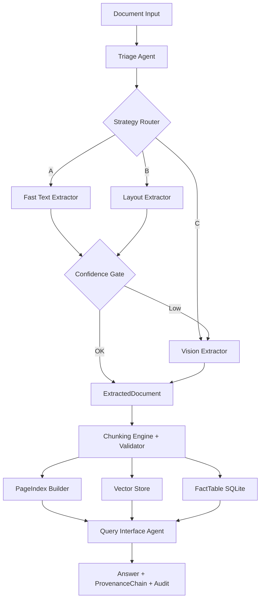

# DOMAIN_NOTES

## Extraction Decision Tree

1. Compute per-page signals from PDF parser:
- Character count
- Character density (`chars / page_area`)
- Image ratio proxy (`image_count / max_images_for_ratio`)

2. Classify origin:
- `scanned_image` when density is low and image ratio is high.
- `native_digital` when density is high and image ratio is low.
- `mixed` otherwise.

3. Estimate layout complexity:
- `table_heavy` if pipe-delimited/table-like lines are frequent.
- `multi_column` if short-line frequency is high.
- `figure_heavy` if figure/chart indicators appear.
- `single_column` otherwise.

4. Strategy routing:
- Strategy A (`fast_text`) for `fast_text_sufficient`
- Strategy B (`layout_aware`) for `needs_layout_model`
- Strategy C (`vision_augmented`) for `needs_vision_model`

5. Escalation guard:
- If strategy confidence < `confidence_minimum`, escalate A->B->C.

## Observed Failure Modes and Mitigation

- Structure collapse: flattening of tables into text streams.
  Mitigation: promote candidate tables to structured JSON in layout strategy.

- Context poverty: semantically incomplete chunks hurt retrieval.
  Mitigation: LDU chunking with rule constraints and parent-section propagation.

- Provenance blindness: answers without source trace are untrustworthy.
  Mitigation: every chunk carries page refs, bbox, and content hash.

## Cost-Quality Tradeoff

- Strategy A (fast text): lowest cost, sufficient for clean native PDFs.
- Strategy B (layout aware): medium cost, needed for table/multi-column layouts.
- Strategy C (vision): highest cost, reserved for scanned or low-confidence extraction.

Budget guard prevents high-cost overrun per document.

## Pipeline Diagram

